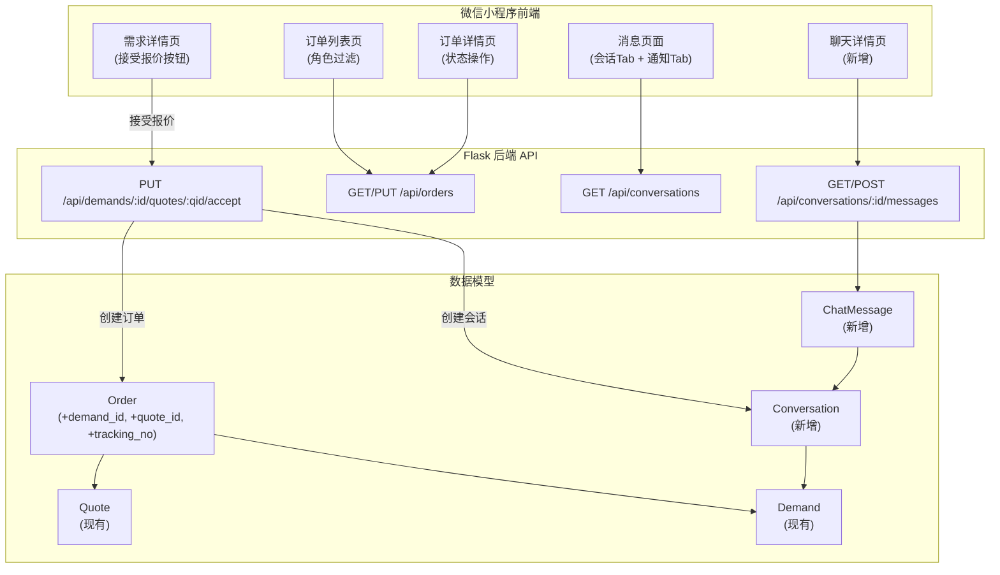

# Design Document: Order & Chat System

## Overview

本设计文档描述纺织面料平台的两项核心增强：报价转订单流程和会话聊天系统。

**报价转订单流程**：在现有 Quote 模型基础上，新增"接受报价"API。当采购方接受某条报价时，系统自动创建 Order（关联 Demand + Quote），同时关闭需求、拒绝其他报价。现有 Order 模型需新增 `demand_id` 和 `quote_id` 外键，`tracking_no` 物流单号字段。现有 OrderItem 不再用于报价转订单场景（该场景下订单信息直接来自 Quote + Demand）。

**会话聊天系统**：新增 Conversation 和 ChatMessage 两个模型。当供应商提交报价时自动创建会话。消息页面从纯通知列表改为"会话列表 + 通知列表"双 Tab 布局。新增聊天详情页支持实时消息收发。

技术栈保持不变：Flask + SQLAlchemy + SQLite/MySQL 后端，微信小程序前端。

## Architecture



## Components and Interfaces

### Backend API Endpoints

#### 1. Accept Quote (新增)
```
PUT /api/demands/<demand_id>/quotes/<quote_id>/accept
```
- Auth: JWT, buyer only, must own the demand
- Action: Accept quote → create order → close demand → reject other quotes → create conversation → send notifications
- Response: `{ order: OrderDict, conversation_id: int }`

#### 2. Order List (修改现有)
```
GET /api/orders?page=1&per_page=20&status=pending
```
- Auth: JWT
- Changes: Admin sees all orders; response includes demand_title, quote_price, counterparty info
- Response: `{ items: [...], total, page, per_page }`

#### 3. Order Detail (修改现有)
```
GET /api/orders/<order_id>
```
- Auth: JWT, buyer/supplier/admin
- Changes: Include demand info, quote info, tracking_no

#### 4. Update Order Status (修改现有)
```
PUT /api/orders/<order_id>/status
```
- Auth: JWT
- Changes: Accept `tracking_no` when transitioning to "shipped"; buyer can also transition to "completed"
- Body: `{ status: "shipped", tracking_no: "SF1234567890" }`

#### 5. Conversation List (新增)
```
GET /api/conversations?page=1&per_page=20
```
- Auth: JWT
- Buyer/Supplier: own conversations; Admin: all conversations
- Response includes: counterparty info, demand title, last message preview, unread count

#### 6. Conversation Messages (新增)
```
GET /api/conversations/<conv_id>/messages?page=1&per_page=30
```
- Auth: JWT, participant or admin
- Auto-marks messages from other party as read
- Response: `{ items: [...], total, page, per_page }`

#### 7. Send Message (新增)
```
POST /api/conversations/<conv_id>/messages
```
- Auth: JWT, participant only (admin read-only)
- Body: `{ content: "消息内容" }`
- Updates conversation last_message_at and last_message_preview

#### 8. Unread Conversation Count (新增)
```
GET /api/conversations/unread-count
```
- Auth: JWT
- Response: `{ count: int }`

### Frontend Pages

#### Modified Pages
1. **需求详情页** (`demand/detail`): 采购方报价列表中每条报价增加"接受报价"按钮
2. **订单列表页** (`order/list`): 支持 admin 查看全部订单；订单卡片显示需求标题和对方公司名
3. **订单详情页** (`order/detail`): 显示关联需求和报价信息；发货时支持填写物流单号；admin 可查看
4. **消息页面** (`message/message`): 改为双 Tab 布局（会话 / 通知）

#### New Pages
5. **聊天详情页** (`message/chat/chat`): 聊天气泡界面，底部输入框，消息分页加载

## Data Models

### Order Model Changes (修改现有)

```python
class Order(db.Model):
    # ... existing fields ...
    
    # New fields
    demand_id = db.Column(db.Integer, db.ForeignKey('demands.id'), nullable=True)
    quote_id = db.Column(db.Integer, db.ForeignKey('quotes.id'), nullable=True)
    tracking_no = db.Column(db.String(100), nullable=True)  # 物流单号
    
    # New relationships
    demand = db.relationship('Demand', backref=db.backref('orders', lazy='dynamic'))
    quote = db.relationship('Quote', backref=db.backref('order', uselist=False))
```

`to_dict()` 更新：包含 `demand_id`, `quote_id`, `tracking_no` 字段。

### Conversation Model (新增)

```python
class Conversation(db.Model):
    __tablename__ = 'conversations'
    
    id = db.Column(db.Integer, primary_key=True)
    demand_id = db.Column(db.Integer, db.ForeignKey('demands.id'), nullable=False)
    buyer_id = db.Column(db.Integer, db.ForeignKey('users.id'), nullable=False)
    supplier_id = db.Column(db.Integer, db.ForeignKey('users.id'), nullable=False)
    last_message_at = db.Column(db.DateTime, nullable=True)
    last_message_preview = db.Column(db.String(100), nullable=True)
    created_at = db.Column(db.DateTime, default=datetime.utcnow, nullable=False)
    
    # Unique constraint: one conversation per (demand, buyer, supplier)
    __table_args__ = (
        db.UniqueConstraint('demand_id', 'buyer_id', 'supplier_id', name='uq_conversation'),
    )
```

### ChatMessage Model (新增)

```python
class ChatMessage(db.Model):
    __tablename__ = 'chat_messages'
    
    id = db.Column(db.Integer, primary_key=True)
    conversation_id = db.Column(db.Integer, db.ForeignKey('conversations.id'), nullable=False)
    sender_id = db.Column(db.Integer, db.ForeignKey('users.id'), nullable=False)
    content = db.Column(db.Text, nullable=False)
    msg_type = db.Column(
        db.Enum('text', 'system', name='chat_msg_type', validate_strings=True),
        default='text', nullable=False
    )
    is_read = db.Column(db.Boolean, default=False, nullable=False)
    created_at = db.Column(db.DateTime, default=datetime.utcnow, nullable=False)
```

### Key Design Decisions

1. **Order 保留 OrderItem 兼容性**：现有的 fabric-based 订单创建流程继续使用 OrderItem。报价转订单场景下 OrderItem 不创建，订单信息直接来自 Quote + Demand。`demand_id` 和 `quote_id` 为 nullable 以保持向后兼容。

2. **Conversation 唯一约束**：`(demand_id, buyer_id, supplier_id)` 三元组唯一，确保同一需求下同一对买卖双方只有一个会话。

3. **ChatMessage.is_read 按消息粒度**：每条消息独立标记已读状态，打开会话时批量标记对方消息为已读。

4. **消息页面双 Tab**：保留现有通知系统，新增会话 Tab。通知 Tab 继续使用现有 Message 模型，会话 Tab 使用新的 Conversation 模型。

5. **Admin 只读会话**：Admin 可查看所有会话和消息，但不能发送消息，仅用于监控。


## Correctness Properties

*A property is a characteristic or behavior that should hold true across all valid executions of a system — essentially, a formal statement about what the system should do. Properties serve as the bridge between human-readable specifications and machine-verifiable correctness guarantees.*

### Property 1: Accept quote produces correct order and state changes

*For any* Demand with N pending Quotes (N ≥ 1), when the Buyer accepts one Quote, the system should: (a) create an Order with status "pending" linking the correct buyer_id, supplier_id, demand_id, quote_id, and total_amount = quote.price × demand.quantity; (b) set the accepted Quote status to "accepted" and all other Quotes to "rejected"; (c) set the Demand status to "closed"; (d) create a notification for the Supplier.

**Validates: Requirements 1.1, 1.2, 1.3**

### Property 2: Role-based order list filtering

*For any* set of Orders across multiple Buyers and Suppliers, querying the order list as a Buyer returns only orders where buyer_id matches, querying as a Supplier returns only orders where supplier_id matches, and querying as Admin returns all orders.

**Validates: Requirements 2.1, 2.2, 2.3, 9.3**

### Property 3: Order list items contain required fields

*For any* Order returned in the list endpoint, the response should include demand_title, quote_price, and counterparty company_name fields (non-null when demand_id and quote_id are set).

**Validates: Requirements 2.4**

### Property 4: Order detail contains all required fields and timeline

*For any* Order at any status, the detail endpoint should return order_no, status, total_amount, demand info, quote info, buyer info, supplier info, and a timeline array of exactly 6 entries with the current status correctly marked.

**Validates: Requirements 3.1, 3.2, 3.3**

### Property 5: Valid sequential status transitions succeed

*For any* Order at status S where S is in [pending, confirmed, producing, shipped, received], transitioning to the next sequential status S+1 (by the authorized role) should succeed and update the order status to S+1. When transitioning to "shipped", the tracking_no should be stored.

**Validates: Requirements 4.1, 4.2, 4.3, 5.1, 5.2**

### Property 6: Status change triggers notification

*For any* successful Order status transition, a notification Message should be created for the other party (Buyer notified when Supplier changes status, Supplier notified when Buyer changes status) containing the new status label.

**Validates: Requirements 4.4, 5.3**

### Property 7: Invalid status transitions are rejected

*For any* Order at status S and any target status T where T is not the immediate next status after S, the transition should be rejected with an error response.

**Validates: Requirements 4.5, 5.4, 1.4**

### Property 8: Quote submission creates conversation

*For any* Supplier submitting a Quote on a Demand, a Conversation should exist linking the Supplier, the Demand's Buyer, and the Demand.

**Validates: Requirements 6.1**

### Property 9: Conversation creation idempotence

*For any* (demand_id, buyer_id, supplier_id) triple, creating a conversation twice should result in exactly one Conversation record (the unique constraint prevents duplicates).

**Validates: Requirements 6.2**

### Property 10: New conversation has system message

*For any* newly created Conversation (via quote submission), there should be exactly one ChatMessage with msg_type="system" containing the quote price information.

**Validates: Requirements 6.3**

### Property 11: Sent message stored and conversation metadata updated

*For any* ChatMessage sent in a Conversation, the message should be persisted with correct sender_id, content, and created_at, and the Conversation's last_message_at should equal the message's created_at and last_message_preview should contain a prefix of the message content.

**Validates: Requirements 7.1, 7.2**

### Property 12: Messages returned in chronological order

*For any* Conversation with N messages, the messages endpoint should return them sorted by created_at ascending.

**Validates: Requirements 7.3**

### Property 13: Opening conversation marks messages as read

*For any* Conversation where user A has unread messages from user B, when user A fetches the messages, all of user B's messages should be marked as is_read=True.

**Validates: Requirements 7.4**

### Property 14: Conversation list is role-filtered and sorted

*For any* user, the conversation list returns only conversations where the user is buyer_id or supplier_id (or all conversations for Admin), sorted by last_message_at descending.

**Validates: Requirements 8.1, 9.1**

### Property 15: Conversation list items contain required fields

*For any* Conversation in the list response, the response should include counterparty company_name, demand_title, last_message_preview, last_message_at, and unread_count.

**Validates: Requirements 8.2**

### Property 16: Unread conversation count accuracy

*For any* user, the unread-count endpoint should return a count equal to the number of ChatMessages where the user is a conversation participant, the message sender is the other party, and is_read is False.

**Validates: Requirements 8.4**

## Error Handling

### Backend Error Handling

| Scenario | HTTP Code | Error Message |
|---|---|---|
| Accept quote on non-open demand | 400 | 该需求已关闭，无法接受报价 |
| Accept quote not belonging to user's demand | 403 | 无权操作此报价 |
| Quote or demand not found | 404 | 报价/需求不存在 |
| Invalid status transition | 400 | 不允许从 X 转换到 Y |
| Unauthorized order access | 403 | 无权查看此订单 |
| Send message to non-participant conversation | 403 | 无权在此会话中发送消息 |
| Admin attempts to send message | 403 | 管理员仅可查看会话 |
| Empty message content | 400 | 消息内容不能为空 |
| Conversation not found | 404 | 会话不存在 |

### Frontend Error Handling

- API 请求失败时显示 `wx.showToast` 错误提示
- 网络断开时显示重试按钮
- 聊天消息发送失败时在消息气泡上显示重发图标

## Testing Strategy

### Property-Based Testing

使用 **Hypothesis** (Python) 作为属性测试库，每个属性测试运行至少 100 次迭代。

每个 correctness property 对应一个独立的 property-based test，使用 Hypothesis 的 `@given` 装饰器生成随机输入。

测试标签格式：`Feature: order-chat-system, Property {N}: {property_text}`

重点属性测试：
- Property 1 (accept quote): 生成随机 demand + N quotes，接受一个，验证所有状态变更
- Property 2 (role filtering): 生成多用户多订单，按角色查询验证过滤
- Property 5 (status transitions): 生成随机起始状态，验证合法/非法转换
- Property 7 (invalid transitions): 生成所有非法状态对，验证拒绝
- Property 9 (idempotence): 重复创建会话验证唯一性
- Property 12 (chronological order): 生成随机消息序列，验证排序
- Property 16 (unread count): 生成随机消息读取模式，验证计数

### Unit Testing

单元测试覆盖具体示例和边界情况：
- 接受报价时需求只有一个报价的场景
- 订单状态从 pending 到 completed 的完整流程
- 空消息内容的拒绝
- Admin 查看会话但不能发消息
- 会话列表为空时的响应
- 物流单号在非 shipped 状态下的忽略

### Integration Testing

- 完整的报价→订单→状态流转→完成流程
- 报价→会话创建→消息收发→已读标记流程
- 多角色并发操作场景
