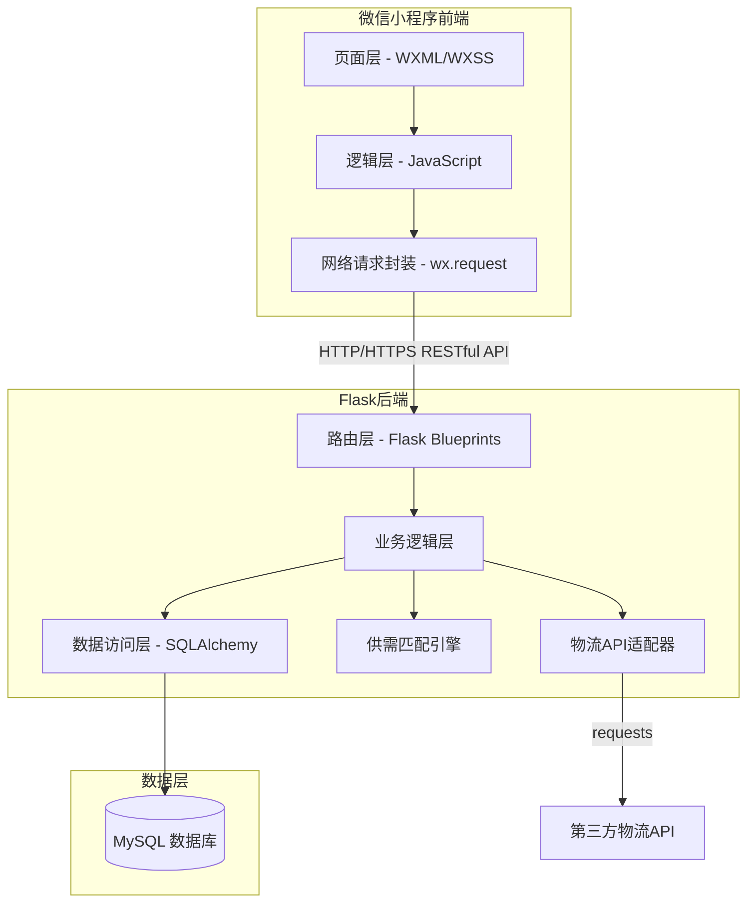
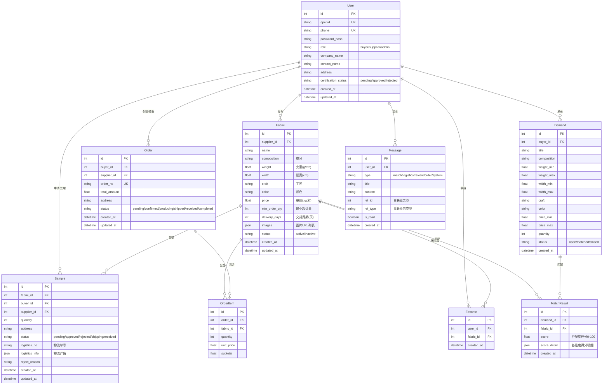

# 设计文档

## 概述

本设计文档描述纺织面料智能查询与供需对接平台的技术架构和实现方案。平台采用微信小程序作为前端，Python Flask 作为后端，MySQL 作为数据存储，实现面料参数标准化管理、智能供需匹配、样品管理、订单管理等核心功能。

## 架构

### 整体架构

平台采用前后端分离的 C/S 架构：



### 目录结构

```
textile-fabric-platform/
├── miniprogram/                    # 微信小程序前端
│   ├── app.js                      # 小程序入口
│   ├── app.json                    # 全局配置
│   ├── app.wxss                    # 全局样式
│   ├── utils/
│   │   ├── request.js              # 网络请求封装
│   │   ├── auth.js                 # 认证工具
│   │   └── util.js                 # 通用工具
│   ├── pages/
│   │   ├── login/                  # 登录页
│   │   ├── home/                   # 首页
│   │   ├── fabric/
│   │   │   ├── list/               # 面料列表
│   │   │   ├── detail/             # 面料详情
│   │   │   └── compare/            # 面料对比
│   │   ├── demand/
│   │   │   ├── publish/            # 需求发布
│   │   │   └── match/              # 匹配结果
│   │   ├── sample/                 # 样品管理
│   │   ├── order/
│   │   │   ├── list/               # 订单列表
│   │   │   ├── create/             # 创建订单
│   │   │   └── detail/             # 订单详情
│   │   ├── message/                # 消息中心
│   │   └── profile/                # 个人中心
│   └── components/
│       ├── fabric-card/            # 面料卡片组件
│       ├── status-tag/             # 状态标签组件
│       ├── loading-skeleton/       # 骨架屏组件
│       └── empty-state/            # 空状态组件
│
├── server/                         # Flask 后端
│   ├── app.py                      # Flask 应用入口
│   ├── config.py                   # 配置文件
│   ├── extensions.py               # 扩展初始化（db, jwt）
│   ├── models/
│   │   ├── user.py                 # 用户模型
│   │   ├── fabric.py               # 面料模型
│   │   ├── demand.py               # 需求模型
│   │   ├── sample.py               # 样品模型
│   │   ├── order.py                # 订单模型
│   │   └── message.py              # 消息模型
│   ├── routes/
│   │   ├── auth.py                 # 认证路由
│   │   ├── fabric.py               # 面料路由
│   │   ├── demand.py               # 需求路由
│   │   ├── sample.py               # 样品路由
│   │   ├── order.py                # 订单路由
│   │   └── message.py              # 消息路由
│   ├── services/
│   │   ├── matching.py             # 供需匹配服务
│   │   ├── logistics.py            # 物流服务
│   │   └── notification.py         # 通知服务
│   └── tests/
│       ├── test_matching.py        # 匹配算法测试
│       ├── test_models.py          # 模型测试
│       └── test_routes.py          # 路由测试
│
└── requirements.txt                # Python 依赖
```

## 组件与接口

### 1. 认证模块

**后端接口：**

```python
# POST /api/auth/wx-login
# 微信授权登录
def wx_login(code: str) -> dict:
    """
    参数: code - 微信登录凭证
    返回: { token: str, user: UserInfo, is_new: bool }
    """

# POST /api/auth/register
def register(phone: str, code: str, role: str) -> dict:
    """
    参数: phone - 手机号, code - 验证码, role - 角色(buyer/supplier)
    返回: { token: str, user: UserInfo }
    """

# POST /api/auth/login
def login(phone: str, password: str) -> dict:
    """
    返回: { token: str, user: UserInfo }
    """
```

**前端请求封装：**

```javascript
// utils/request.js
const request = (url, method, data) => {
  return new Promise((resolve, reject) => {
    wx.request({
      url: BASE_URL + url,
      method,
      data,
      header: { 'Authorization': 'Bearer ' + wx.getStorageSync('token') },
      success: res => resolve(res.data),
      fail: err => reject(err)
    })
  })
}
```

### 2. 面料管理模块

**后端接口：**

```python
# POST /api/fabrics
def create_fabric(data: FabricCreateDTO) -> dict:
    """
    必填字段: composition, weight, width, craft, price
    可选字段: color, min_order_qty, delivery_days, images
    返回: { id: int, ...fabric_info }
    """

# GET /api/fabrics?composition=&craft=&price_min=&price_max=&page=&per_page=
def list_fabrics(filters: FabricQueryDTO) -> dict:
    """
    返回: { items: [FabricInfo], total: int, page: int, per_page: int }
    """

# GET /api/fabrics/<id>
def get_fabric(id: int) -> dict:
    """返回面料完整信息"""

# GET /api/fabrics/compare?ids=1,2,3
def compare_fabrics(ids: list[int]) -> dict:
    """返回多个面料的参数对比数据"""
```

### 3. 供需匹配模块

**后端接口：**

```python
# POST /api/demands
def create_demand(data: DemandCreateDTO) -> dict:
    """创建采购需求并触发匹配"""

# GET /api/demands/<id>/matches
def get_matches(demand_id: int) -> dict:
    """返回匹配结果列表，按匹配度降序"""
```

**匹配算法核心：**

```python
class MatchingEngine:
    def __init__(self, ahp_weights: dict):
        """
        ahp_weights: AHP 层次分析法计算的各参数权重
        如 { 'composition': 0.3, 'weight': 0.2, 'craft': 0.25, 'price': 0.15, 'width': 0.1 }
        """

    def calculate_score(self, demand: Demand, fabric: Fabric) -> float:
        """
        计算单个面料与需求的匹配度评分 (0-100)
        1. 关键词匹配：对比成分、工艺等文本字段的相似度
        2. 数值匹配：对比克重、幅宽、价格等数值字段的接近程度
        3. AHP 加权：按权重汇总各维度得分
        """

    def match(self, demand: Demand, fabrics: list[Fabric]) -> list[MatchResult]:
        """对所有面料计算匹配度并按评分降序排列"""
```

### 4. 样品管理模块

```python
# POST /api/samples
def create_sample_request(fabric_id: int, quantity: int, address: str) -> dict:
    """创建样品申请"""

# PUT /api/samples/<id>/review
def review_sample(id: int, status: str, reason: str = None) -> dict:
    """供应商审核样品申请 (approved/rejected)"""

# GET /api/samples/<id>/logistics
def get_sample_logistics(id: int) -> dict:
    """查询样品物流状态"""
```

### 5. 订单管理模块

```python
# POST /api/orders
def create_order(data: OrderCreateDTO) -> dict:
    """创建订单，校验面料、数量、价格、收货地址"""

# PUT /api/orders/<id>/status
def update_order_status(id: int, status: str) -> dict:
    """更新订单状态：pending -> confirmed -> producing -> shipped -> received -> completed"""

# GET /api/orders?page=&per_page=
def list_orders(page: int, per_page: int) -> dict:
    """按创建时间降序返回分页订单"""
```

### 6. 消息通知模块

```python
# GET /api/messages?page=&per_page=
def list_messages(page: int, per_page: int) -> dict:
    """返回用户消息列表，按时间降序"""

# PUT /api/messages/<id>/read
def mark_as_read(id: int) -> dict:
    """标记消息为已读"""
```

## 数据模型

### ER 关系图



### SQLAlchemy 模型示例

```python
class User(db.Model):
    __tablename__ = 'users'
    id = db.Column(db.Integer, primary_key=True)
    openid = db.Column(db.String(128), unique=True, nullable=True)
    phone = db.Column(db.String(20), unique=True, nullable=True)
    password_hash = db.Column(db.String(256))
    role = db.Column(db.Enum('buyer', 'supplier', 'admin'), nullable=False)
    company_name = db.Column(db.String(200))
    contact_name = db.Column(db.String(100))
    address = db.Column(db.String(500))
    certification_status = db.Column(db.Enum('pending', 'approved', 'rejected'), default='pending')
    created_at = db.Column(db.DateTime, default=datetime.utcnow)
    updated_at = db.Column(db.DateTime, default=datetime.utcnow, onupdate=datetime.utcnow)

class Fabric(db.Model):
    __tablename__ = 'fabrics'
    id = db.Column(db.Integer, primary_key=True)
    supplier_id = db.Column(db.Integer, db.ForeignKey('users.id'), nullable=False)
    name = db.Column(db.String(200), nullable=False)
    composition = db.Column(db.String(200), nullable=False)
    weight = db.Column(db.Float, nullable=False)       # 克重 g/m2
    width = db.Column(db.Float, nullable=False)         # 幅宽 cm
    craft = db.Column(db.String(100), nullable=False)   # 工艺
    color = db.Column(db.String(100))
    price = db.Column(db.Float, nullable=False)         # 单价 元/米
    min_order_qty = db.Column(db.Integer)
    delivery_days = db.Column(db.Integer)
    images = db.Column(db.JSON, default=[])
    status = db.Column(db.Enum('active', 'inactive'), default='active')
    created_at = db.Column(db.DateTime, default=datetime.utcnow)
    updated_at = db.Column(db.DateTime, default=datetime.utcnow, onupdate=datetime.utcnow)
```


## 正确性属性

*正确性属性是系统在所有有效执行中都应保持为真的特征或行为——本质上是关于系统应该做什么的形式化陈述。属性作为人类可读规范与机器可验证正确性保证之间的桥梁。*

### Property 1: 手机号格式验证

*对于任意*字符串，如果该字符串符合中国大陆手机号格式（1开头、第二位为3-9、共11位数字），验证函数应返回通过；否则应返回失败。

**验证: 需求 1.2**

### Property 2: JWT 令牌有效性

*对于任意*有效用户凭证（正确的手机号和密码），登录后返回的 JWT 令牌应能被成功解码，且解码后的用户ID与登录用户一致。对于任意无效凭证，登录应返回错误而非令牌。

**验证: 需求 1.3, 1.4**

### Property 3: 用户角色约束

*对于任意*用户记录，其角色字段的值必须是 buyer、supplier、admin 三者之一。

**验证: 需求 2.1**

### Property 4: 未认证用户访问控制

*对于任意*认证状态非 approved 的用户和任意受限 API 端点，请求应返回 403 状态码。

**验证: 需求 2.5**

### Property 5: 用户资质审核状态转换

*对于任意*处于 pending 状态的用户，管理员执行审核通过操作后，该用户的认证状态应变为 approved，且应生成一条审核通知消息。

**验证: 需求 2.6**

### Property 6: 面料参数标准化校验

*对于任意*面料提交数据，如果缺少成分、克重、幅宽、工艺、价格中的任何一个必填字段，校验应失败并返回缺失字段名称；如果所有必填字段都存在且格式正确，校验应通过。

**验证: 需求 3.1, 3.2**

### Property 7: 面料数据持久化往返

*对于任意*有效面料数据，创建面料后通过 ID 查询应返回与提交数据一致的面料信息；更新面料后再次查询应返回更新后的数据。

**验证: 需求 3.3, 3.6**

### Property 8: 面料字段完整性

*对于任意*面料记录，应包含以下所有字段：成分、克重、幅宽、工艺、颜色、价格、最小起订量、交货周期。

**验证: 需求 3.5**

### Property 9: 面料多条件筛选正确性

*对于任意*查询条件组合（成分、工艺、价格区间、克重范围、颜色），返回的每一条面料记录都应满足所有指定的筛选条件。

**验证: 需求 4.1**

### Property 10: 面料对比数据完整性

*对于任意*面料 ID 集合，对比接口返回的结果应包含每个面料的所有参数字段，且面料数量与请求的 ID 数量一致。

**验证: 需求 4.5**

### Property 11: 分页查询正确性

*对于任意*分页查询请求（page, per_page），返回的结果数量应不超过 per_page，且 total 字段应正确反映满足条件的总记录数。

**验证: 需求 4.6**

### Property 12: 供需匹配评分范围与排序

*对于任意*需求和面料集合，匹配引擎计算的每个匹配度评分应在 0-100 范围内，且返回的匹配结果列表应按评分降序排列。

**验证: 需求 5.2, 5.3**

### Property 13: 需求发布触发匹配

*对于任意*新发布的采购需求，如果数据库中存在 active 状态的面料，匹配引擎应生成至少零条匹配结果（即匹配过程应被执行）。同样，*对于任意*新发布的面料，应与所有 open 状态的需求进行匹配。

**验证: 需求 5.1, 5.6**

### Property 14: 事件触发通知创建

*对于任意*业务事件（匹配结果生成、物流状态更新、审核结果产生），系统应为相关用户创建包含正确类型和关联业务 ID 的通知消息。

**验证: 需求 5.4, 8.1, 8.2, 8.3**

### Property 15: 样品申请创建与状态转换

*对于任意*样品申请，创建后状态应为 pending；供应商审核通过后状态应变为 approved，拒绝后应变为 rejected。

**验证: 需求 6.1, 6.2**

### Property 16: 订单创建往返

*对于任意*有效订单数据（包含面料、数量、价格、收货地址），创建订单后通过 ID 查询应返回与提交数据一致的订单信息。对于缺少必填字段的订单数据，创建应失败。

**验证: 需求 7.1, 7.2**

### Property 17: 订单状态机合法性

*对于任意*订单，状态转换只能按照 pending → confirmed → producing → shipped → received → completed 的顺序进行。任何跳跃或逆向的状态转换应被拒绝。

**验证: 需求 7.3, 7.6**

### Property 18: 消息已读标记

*对于任意*未读消息，执行标记已读操作后，该消息的 is_read 字段应为 true。对已读消息重复标记应保持幂等。

**验证: 需求 8.5**

### Property 19: 消息字段完整性

*对于任意*消息记录，应包含以下所有字段：消息类型、标题、内容、关联业务ID、创建时间、已读状态。

**验证: 需求 8.6**

### Property 20: 用户资料更新往返

*对于任意*有效的用户资料更新数据，更新后查询用户信息应返回更新后的值。

**验证: 需求 9.1**

### Property 21: 收藏往返

*对于任意*用户和面料，收藏后查询收藏列表应包含该面料；取消收藏后查询收藏列表应不包含该面料。

**验证: 需求 9.2, 9.3**

## 错误处理

### 网络层错误

| 错误场景 | 前端处理 | 后端处理 |
|---------|---------|---------|
| 网络超时 | 展示"网络连接超时"提示，提供重试按钮 | 设置请求超时时间（30s） |
| 服务器不可用 | 展示"服务暂时不可用"提示 | 返回 503 状态码 |
| 请求频率过高 | 展示"操作过于频繁"提示 | 返回 429 状态码 |

### 业务层错误

| 错误场景 | 处理方式 |
|---------|---------|
| JWT 令牌过期 | 后端返回 401，前端自动跳转登录页 |
| 权限不足 | 后端返回 403，前端展示权限不足提示 |
| 数据校验失败 | 后端返回 400 + 具体字段错误信息，前端高亮错误字段 |
| 资源不存在 | 后端返回 404，前端展示"内容不存在"提示 |
| 物流 API 调用失败 | 记录错误日志，标记待重试，下次同步时重试 |
| 数据库操作失败 | 事务回滚，返回 500，记录错误日志 |

### 全局错误处理

```python
# 后端统一错误响应格式
{
    "code": 400,
    "message": "参数校验失败",
    "errors": {
        "composition": "成分为必填项",
        "price": "价格必须大于0"
    }
}
```

```javascript
// 前端统一错误处理
const request = (url, method, data) => {
  return new Promise((resolve, reject) => {
    wx.request({
      // ...
      success: res => {
        if (res.statusCode === 401) {
          wx.redirectTo({ url: '/pages/login/login' })
          return reject(new Error('登录已过期'))
        }
        if (res.statusCode >= 400) {
          wx.showToast({ title: res.data.message || '操作失败', icon: 'none' })
          return reject(res.data)
        }
        resolve(res.data)
      },
      fail: () => {
        wx.showToast({ title: '网络连接失败，请重试', icon: 'none' })
        reject(new Error('网络错误'))
      }
    })
  })
}
```

## 测试策略

### 测试框架选择

- **后端单元测试**: pytest
- **后端属性测试**: Hypothesis（Python 属性测试库）
- **前端测试**: 微信小程序原生框架暂无成熟的自动化测试方案，以手动测试和后端 API 测试为主

### 属性测试配置

- 每个属性测试最少运行 100 次迭代
- 每个属性测试必须以注释引用设计文档中的属性编号
- 标签格式: **Feature: textile-fabric-platform, Property {编号}: {属性描述}**
- 每个正确性属性由一个独立的属性测试实现

### 单元测试范围

单元测试聚焦于：
- 具体的示例和边界情况（如空字符串、极端数值）
- 组件间的集成点
- 错误条件和异常处理
- 状态转换的边界情况

### 属性测试范围

属性测试聚焦于：
- 数据校验的通用规则（Property 1, 6）
- 数据持久化的往返一致性（Property 7, 16, 20, 21）
- 排序和分页的正确性（Property 11, 12）
- 状态机的合法性（Property 15, 17）
- 筛选和匹配的正确性（Property 9, 12, 13）
- 访问控制的一致性（Property 4）

### 测试目录结构

```
server/tests/
├── conftest.py                 # 测试配置和 fixtures
├── test_auth.py                # 认证模块测试 (Property 1, 2, 3, 4)
├── test_fabric.py              # 面料模块测试 (Property 6, 7, 8, 9, 10, 11)
├── test_matching.py            # 匹配算法测试 (Property 12, 13)
├── test_sample.py              # 样品模块测试 (Property 15)
├── test_order.py               # 订单模块测试 (Property 16, 17)
├── test_message.py             # 消息模块测试 (Property 14, 18, 19)
└── test_user.py                # 用户模块测试 (Property 5, 20, 21)
```
